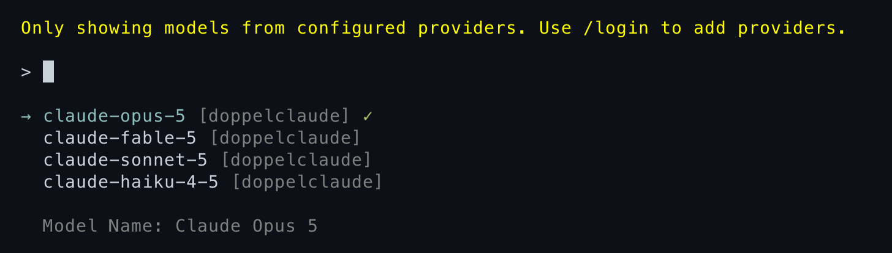
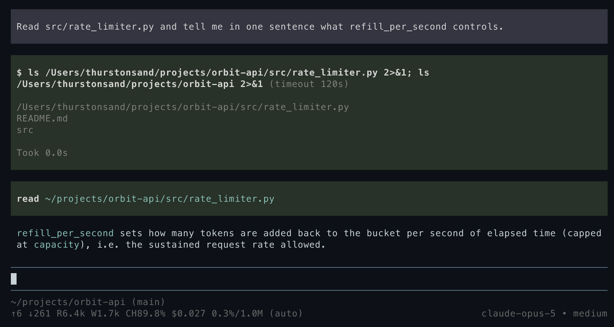

# pi-doppelclaude

[](https://www.npmjs.com/package/pi-doppelclaude)
[](https://www.npmjs.com/package/pi-doppelclaude)
[](https://github.com/thurstonsand/pi-doppelclaude/actions/workflows/ci.yml)
[](https://nodejs.org)
[](LICENSE)

Your Claude Code subscription, in [pi](https://pi.dev) (yes, even after Anthropic's lockdown).

`pi-doppelclaude` registers a native pi provider that runs Claude models through the [Claude Agent SDK](https://github.com/anthropics/claude-agent-sdk-typescript). Claude Code handles authentication and model execution, pi brings all its tools. Just choose `doppelclaude/claude-*` in `/model` and go.





Forked from [pi-claude-bridge](https://github.com/elidickinson/pi-claude-bridge) by Eli Dickinson, which was itself based on [claude-agent-sdk-pi](https://github.com/prateekmedia/claude-agent-sdk-pi) by Prateek Sunal.

## Install

```bash
pi install npm:pi-doppelclaude
```

Authenticate with Claude Code first; pi stores no key for this provider.

```sh
claude auth login
```

Then configure the system prompt. **This step is not optional** — see below.

For local development from a clone:

```bash
pi -e ./src/index.ts
```

## Read this part

> [!IMPORTANT]
> This extension will not start until you write your own system prompt replacements. There is intentionally no default, read on.

Yes, Anthropic locked down their subscription from use in other harnesses. The way they've done that is to gate access either through Claude Code or via the Agent SDK. This extension loads your subscription via the Agent SDK, which is supported as a use case for your subscription for personal use.

Even then, if you try to use the Agent SDK in pi, Anthropic detects pi's system prompt and blocks the request. So I figured out exactly which part of the prompt Anthropic was matching on, and exposed hooks for you to replace them with a different snippet. I'm not hard-coding this into the project because that would theoretically just be another thing for Anthropic to try to match on. Write your own prose. Any prose, as long as it's only yours.

## Configuration

Configuration lives under the `doppelclaude` key in pi's global settings at `~/.pi/agent/settings.json`.

```json
{
  "doppelclaude": {
    "provider": {
      "systemPromptMode": "pi",
      "systemPromptReplacements": {
        "identity": "...",
        "toolNameNote": "...",
        "documentation": {
          "heading": "...",
          "instructions": ["...", "..."]
        }
      },
      "pathToClaudeCodeExecutable": "/home/you/.nix-profile/bin/claude"
    },
    "debug": {
      "enabled": false,
      "logPath": "/home/you/.pi/agent/doppelclaude.log"
    }
  }
}
```

- `systemPromptMode` — `"claude-code"` sends only Claude Code's preset (not recommended), `"pi"` sends only the rewritten pi prompt, `"append"` sends Claude Code's preset with the rewritten pi prompt appended. Default `"pi"`.
- `systemPromptReplacements` — the prose that makes your prompt yours. Required in `"pi"` and `"append"` modes. See [System prompt](#system-prompt).
- `pathToClaudeCodeExecutable` — path to the `claude` binary. Use only when the SDK's binaries can't run on your filesystem for whatever reason.
- `debug.enabled` / `debug.logPath` — see [Debugging](#debugging).

In `"pi"` mode, Claude Code ignores its own settings files — no `~/.claude/settings.json`, no `CLAUDE.md`. pi's `AGENTS.md` and skills are then the only project instructions in play, which is the point of the mode. The other two modes leave Claude Code's settings at its defaults.

MCP servers from your filesystem and from claude.ai are blocked in every mode, since pi is the tool-execution layer here and its tools are the ones that should be offered.

## System prompt

### `identity`

Replaces this opening text:

```md
You are an expert coding assistant operating inside pi, a coding agent harness. You help users by reading files, executing commands, editing code, and writing new files.
```

### `toolNameNote`

Inserted just before pi's `Available tools:` section. pi exposes its tools to Claude Code with MCP-prefixed names, so you might want to explain that `mcp__custom-tools__bash` and the `bash` tool described below it are the same thing.

### `documentation.heading` and `documentation.instructions`

```md
Pi documentation (read only when the user asks about pi itself, its SDK, extensions, themes, skills, or TUI):

- Main documentation: <pi installation>/README.md
- Additional docs: <pi installation>/docs
- Examples: <pi installation>/examples (extensions, custom tools, SDK)
- When reading pi docs or examples, resolve docs/... under Additional docs and examples/... under Examples, not the current working directory
- When asked about: extensions (docs/extensions.md, examples/extensions/), themes (docs/themes.md), skills (docs/skills.md), ...
- When working on pi topics, read the docs and examples, and follow .md cross-references before implementing
- Always read pi .md files completely and follow links to related docs (e.g., tui.md for TUI API details)
```

`heading` replaces the first line. `instructions` is an array of lines that replaces everything after `- Examples: ...`, joined with newlines. The three path lines are preserved, since they differ per machine.

The agent still needs to be told those docs exist and when to read them, so keep the substance and change the wording. Something along these lines, in your own phrasing:

```json
{
  "toolNameNote": "Tool names arrive with a prefix when you call them, but the instructions below refer to them bare. Calling `mcp__custom-tools__bash` is what the `bash` tool means.",
  "documentation": {
    "heading": "Assistant implementation docs (read when the user asks about this assistant, its extensions, themes, or skills):",
    "instructions": [
      "- Resolve relative doc paths against the locations above, not the working directory.",
      "- Read the relevant file completely and follow its cross-references before making changes."
    ]
  }
}
```

### Put it all together

Your replacements fit into the associated `{}` blocks.

```md
{identity}

{toolNameNote}

Available tools:
<pi tool descriptions>

<pi agent guidelines>

{documentation.heading}

- Main documentation: <pi installation>/README.md
- Additional docs: <pi installation>/docs
- Examples: <pi installation>/examples (extensions, custom tools, SDK)
  {documentation.instructions}

<Global and project AGENTS.md instructions>

<pi skills block>

<pi working-directory and runtime context>
```

## Updating models

Use `/model` and pick from the `doppelclaude` provider — `doppelclaude/claude-opus-*`, `doppelclaude/claude-sonnet-*`, and so on.

The catalog is whatever Claude Code currently lists in its own model selector (so no older models).

To pick up a model Claude Code has started, open `/model`. It refreshes catalogs in the background, which re-asks Claude Code what it serves and rewrites the cached entry (`pi update --models` doesn't load extensions so cannot load these models).

**Cost display** — pi applies canonical Anthropic API prices as an API-equivalent reference. Accounting follows the concrete models in Claude Code's `modelUsage`, so if Anthropic downgrades your model mid-turn, it's still accounted for correctly. This is just for display, and you are still using your subscription (unless you enable Extra Usage on your billing account).

### models.json overrides

You can apply `modelOverrides` to any ids that Claude Code exposes: change display details, compaction threshold, and the Claude Code request form:

```json
{
  "providers": {
    "doppelclaude": {
      "modelOverrides": {
        "claude-opus-4-8": { "contextWindow": 200000 }
      }
    }
  }
}
```

pi accepts exactly nine keys in `modelOverrides`. The defaults are all fine, so you likely need none of them, but here is what each one actually does here:

| Key                          | Effect                                                                 |
| ---------------------------- | ---------------------------------------------------------------------- |
| `contextWindow`              | Overrides the compaction threshold                                     |
| `thinkingLevelMap`           | Decides which Claude Code effort level each pi thinking level maps to. |
| `maxTokens`                  | Caps the response length requested per turn.                           |
| `cost`                       | Display only, and only ever an API-equivalent reference.               |
| `name`, `reasoning`, `input` | Display only.                                                          |

What you can't override:

- Adding new models: Claude Code determines what models are available.
- Changing `api` or `baseUrl`: the only supported value is going through what Claude Code uses.
- `headers`, `compat`, or a provider-level `apiKey`: there is no HTTP request being made in pi; everything falls through to Claude Code, which brings its own credentials and wire format.

## How this actually works

The short version: your pi session gets a shadow Claude Code session running alongside it, and they're kept in sync.

When you send a turn, the bridge hands your conversation to a long-lived Claude Code process through the Agent SDK. Claude Code authenticates it, sends it to Anthropic, and streams the response back, which the bridge translates into pi's own event stream as it arrives. Claude Code keeps its own transcript of all this, but under certain situations the bridge may rewrite the Claude Code transcript to align with pi's history. For example, when:

- **You compact.** pi replaces its own long history with a short summary. Claude Code still holds the full original, so the bridge replaces it.
- **You navigate the session tree.** Rewinding to an earlier message, or branching from it, invalidates everything Claude Code recorded after that point.
- **You cancel a turn.** The response is abandoned mid-stream, and Claude Code's view of how far it got may not match what pi kept.
- **You switch to another model or provider and come back.** The turns that happened elsewhere exist only in pi.

Under normal operation, it can keep the prompt cache warm, but as you can see, there are certain situations where we have to throw it away to make sure the Claude Code session sees the same state as pi.

The bridge actually disables ALL normal tools to Claude Code, and instead advertises all of pi's tools through an internal MCP server. So when the model decides to read a file, the call travels out from Claude Code, through the MCP, and lands in pi, which executes it, renders it in the TUI, and returns the result through all those layers back to the model.

## Debugging

Set `doppelclaude.debug.enabled` to `true`. logs are at `~/.pi/agent/doppelclaude.log`. You can also just set `DOPPELCLAUDE_DEBUG=1` (and `DOPPELCLAUDE_DEBUG_PATH`) for one-time debugging sessions.

Two logfiles are generated:

- **The provider log** — every provider call, session sync decision, live MCP reconciliation, served-model usage and fallback, session-store load/append/replace/invalidation, tool result delivery, and Claude Code's stderr. A mirror failure or invalid resume is terminal for that turn; the next request rebuilds the Claude transcript from pi's complete history rather than resuming partial state.
- **Per-query Claude Code CLI logs** in `cc-cli-logs/` beside it — one file per `query()` call, containing the CLI's own view of session loading, API requests, and tool calls. The main `provider` query survives across compatible turns; `provider-child` marks reentrant and subagent queries.

## Development

Node, ShellCheck, and hk are pinned through mise. After trusting the config, `mise run bootstrap` installs dependencies and the git hook, and the mise enter hook keeps it current.

```bash
mise run check      # lint, typecheck, unit tests — all offline
mise run test       # full suite, hits live APIs
```

`npm run test:unit` is the offline suite (`tests/unit-*.ts`). `npm test` adds integration tests against real APIs (`tests/int-*.{sh,ts}`: smoke, multi-turn, cache, sessions, compaction, nested runtimes, tool messages). Set `DOPPELCLAUDE_TESTING_ALT_PROVIDER` and `DOPPELCLAUDE_TESTING_ALT_MODEL` in `.env.test` to any authenticated non-Claude provider/model for the session-resume test.

`tests/int-rejection-smoke.ts` is an on-demand smoke that asks the model to misname a tool so Claude Code rejects it internally, then checks recovery in the debug log. It depends on the model complying, so it reports a skip rather than a failure when no rejection was provoked.

`npm run test:usage` runs a one-off A/B subscription-usage diagnostic against Claude Code direct, to compare what a bridged turn costs against the same turn run natively. It reads Claude Code's OAuth credentials from the macOS keychain and queries Anthropic's `oauth/usage` endpoint, which is aggressively rate limited — repeated runs will start getting refused, so run it sparingly.

## License

MIT
